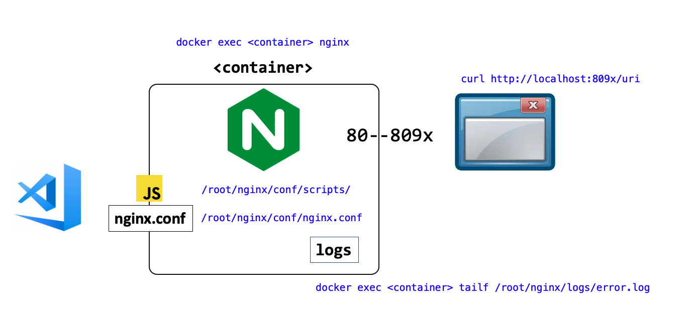

# nginx-njs-usecases

This is a project for demonstrating NJS abilities in NGINX.

In this code repository, there are several NJS usecase implementations.

All the implementations are encapsulated as the docker image. 
See `Dockerfile` for more details such as nginx version, modules, compiling process, etc. 

## Dependencies

* docker
* docker-compose

Navigate to each use case folders for details.

## Run It

Go into the container, and run `nginx`, then the server starts infront.
Use your browser or curl command to access.

## DevOps Model

