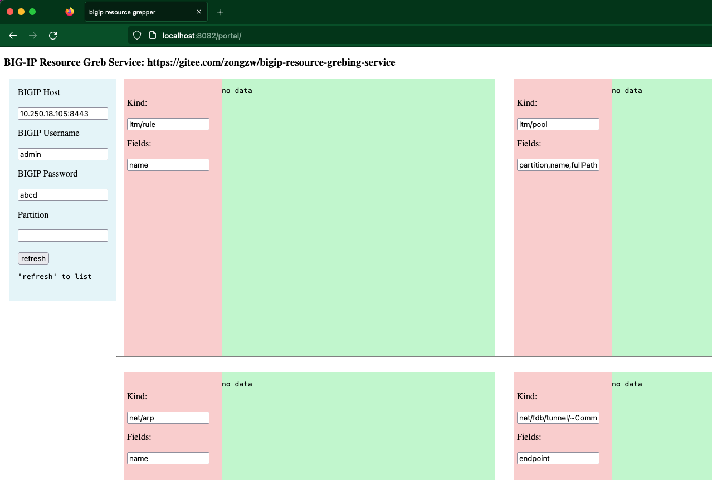

# BIG-IP Resource Grebbing Service

run `./compose.sh` to start docker based service.

Access `http://localhost:8082/portal` via web browser.

Input BIG-IP login info, click 'refresh' button and view the retrived resource list on the right. 

The service includes 

* a portal([index.html](./portal/index.html) and [jquery+ajax](./portal/src.js)). 
* a backend service([nginx](./nginx.conf) and [njs](worker.js)).

