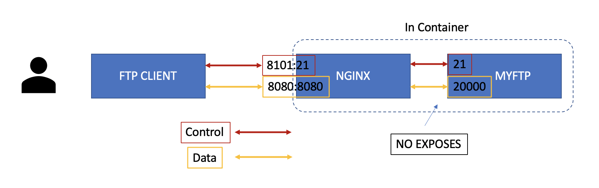

### FTP ALG for NAT Environment

The concept of FTP ALG can be found here: https://www.juniper.net/documentation/en_US/junos/topics/topic-map/security-ftp-alg.html

In FTP PASV mode,

*"The PASV command requests a server to listen on a data port that is not the default data port of the server and to wait for a connection, rather than initiating another connection. The response to the PASV command includes the host and port address the server is listening on."*



In this usecase, `MYFTP` is not accessible from outside. 

`NGINX` is responsible for proxy the control flow and data flow between `FTP ClIENT` and `MYFTP`.

In passive mode, `MYFTP` tells `FTP CLIENT` to connect `127.0.0.1:20000` which is unable to establish the connection. 

`NGINX`'s `ftp.js` will change the PASV response payload from `127.0.0.1:20000` to `172.100.0.106:8080` -- `NGINX`'s data transferring port.

```
       227 Entering Passive Mode (127,0,0,1,78,32). 
    -> 227 Entering Passive Mode (172,100,0,106,31,144).
``` 

After that, `FTP CLIENT` connects to `NGINX`, then let `NGINX` proxy for data transferring.

**FTP CLIENT:**

```
$ ftp 172.100.0.106 8101
Connected to 172.100.0.106.
220 (vsFTPd 3.0.2)
Name (172.100.0.106:zong): zongzw
331 Please specify the password.
Password:
230 Login successful.
ftp> passive                                        <---- Trigger passive mode
Passive mode on.
ftp> ls
227 Entering Passive Mode (172,100,0,106,31,144).   <---- 172.100.0.106:8080
150 Here comes the directory listing.
-rw-r--r--    1 ftp      ftp          7366 Apr 12 12:49 hello.html
drwxr-xr-x    7 ftp      ftp           224 Apr 12 01:57 logos
226 Directory send OK.
ftp> cd logos
250 Directory successfully changed.
ftp> get shape.jpg
227 Entering Passive Mode (172,100,0,106,31,144).
150 Opening BINARY mode data connection for shape.jpg (7214 bytes).
WARNING! 34 bare linefeeds received in ASCII mode
File may not have transferred correctly.
226 Transfer complete.
7214 bytes received in 0.0102 seconds (691 kbytes/s)
ftp> quit
221 Goodbye.
```

**NGINX:**

```
2020/04/13 01:06:20 [info] 27#0: *1 client 172.30.0.1:47978 connected to 0.0.0.0:21
2020/04/13 01:06:20 [info] 27#0: *1 proxy 172.30.0.3:48406 connected to 172.30.0.12:21
2020/04/13 01:06:23 [info] 27#0: *1 js: [debug] >>>> data(13): USER zongzw
 ..
2020/04/13 01:06:25 [info] 27#0: *1 js: [debug] >>>> data(10): PASS 123
 ..
2020/04/13 01:06:31 [info] 27#0: *1 js: [debug] >>>> data(6):PASV
 ..
2020/04/13 01:06:31 [info] 27#0: *1 js: [debug] client send PASV command.
2020/04/13 01:06:31 [info] 27#0: *1 js: [debug] <<<< data(46): 227 Entering Passive Mode (127,0,0,1,78,32).
 ..
2020/04/13 01:06:31 [info] 27#0: *1 js: [debug] get pasv conn: 172.100.0.106, 8080 -> 172,100,0,106,31,144
2020/04/13 01:06:31 [info] 27#0: *1 js: [debug] pasv resp:227Entering Passive Mode (172,100,0,106,31,144).

2020/04/13 01:06:31 [info] 27#0: *3 client 172.30.0.1:41990 connected to 0.0.0.0:8080
2020/04/13 01:06:31 [info] 27#0: *3 js: [debug] FTP_PASV_PORT: 20000
2020/04/13 01:06:31 [info] 27#0: *1 js: [debug] >>>> data(6):LIST
 ..
2020/04/13 01:06:31 [info] 27#0: *3 proxy 172.30.0.3:33114 connected to 172.30.0.12:20000
2020/04/13 01:06:31 [info] 27#0: *3 upstream disconnected, bytes from/to client:0/131, bytes from/to upstream:131/0
2020/04/13 01:06:35 [info] 27#0: *1 js: [debug] >>>> data(11): CWD logos
 ..
2020/04/13 01:06:43 [info] 27#0: *1 js: [debug] >>>> data(6):PASV
 ..
2020/04/13 01:06:43 [info] 27#0: *1 js: [debug] client send PASV command.
2020/04/13 01:06:43 [info] 27#0: *1 js: [debug] <<<< data(46): 227 Entering Passive Mode (127,0,0,1,78,32).
 ..
2020/04/13 01:06:43 [info] 27#0: *1 js: [debug] get pasv conn: 172.100.0.106, 8080 -> 172,100,0,106,31,144
2020/04/13 01:06:43 [info] 27#0: *1 js: [debug] pasv resp:227Entering Passive Mode (172,100,0,106,31,144).

2020/04/13 01:06:43 [info] 27#0: *6 client 172.30.0.1:41996 connected to 0.0.0.0:8080
2020/04/13 01:06:43 [info] 27#0: *6 js: [debug] FTP_PASV_PORT: 20000
2020/04/13 01:06:43 [info] 27#0: *1 js: [debug] >>>> data(16): RETR shape.jpg
 ..
2020/04/13 01:06:43 [info] 27#0: *6 proxy 172.30.0.3:33120 connected to 172.30.0.12:20000
2020/04/13 01:06:43 [info] 27#0: *6 upstream disconnected, bytes from/to client:0/7214, bytes from/to upstream:7214/0
2020/04/13 01:09:07 [info] 27#0: *1 js: [debug] >>>> data(6):QUIT
 ..
2020/04/13 01:09:07 [info] 27#0: *1 upstream disconnected, bytes from/to client:74/386, bytes from/to upstream:376/74
```
