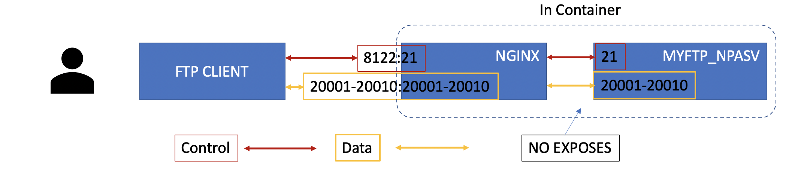

### FTP ALG for NAT Environment

More details about FTP ALG and FTP Passive working model, see [ftp_1pasv_alg](https://github.com/f5devcentral/nginx-njs-usecases/tree/master/ftp_1pasv_alg).

In this usecase, we have a similar diagram like



The difference is that the port used for data transformation is not fixed. They are a set of ports. 

This usecase aims to demonstrate FTP ALG working model of multiple simultaneous connections, which is the issue described in [ftp_1pasv_alg Notes: 500 OOPS](https://github.com/f5devcentral/nginx-njs-usecases/tree/master/ftp_1pasv_alg).

For each new ftp transformation request, `MYFTP_NPASV` picks one port from the set and tell `FTP CLIENT` to connect that port. 

In the mid-way, `NGINX` modifies the PASV command message to let `FTP CLIENT` to connect him. 

`NGINX` is responsible for proxying the control flow and data flow between `FTP ClIENT` and `MYFTP_NPASV`.

With 2 connections to NGINX, the logs from `NGINX` is as following:

```
2020/05/22 22:51:24 [info] 15#0: *1 client 172.30.0.1:49754 connected to 0.0.0.0:21
2020/05/22 22:51:24 [info] 15#0: *1 proxy 172.30.0.15:36990 connected to 172.30.0.14:21
2020/05/22 22:51:27 [info] 15#0: *1 js: [debug] >>>> data(13): USER zongzw
2020/05/22 22:51:28 [info] 15#0: *1 js: [debug] >>>> data(10): PASS 123
2020/05/22 22:51:37 [info] 15#0: *3 client 172.30.0.1:49760 connected to 0.0.0.0:21
2020/05/22 22:51:37 [info] 15#0: *3 proxy 172.30.0.15:36996 connected to 172.30.0.14:21
2020/05/22 22:51:40 [info] 15#0: *3 js: [debug] >>>> data(13): USER zongzw
2020/05/22 22:51:41 [info] 15#0: *3 js: [debug] >>>> data(10): PASS 123
2020/05/22 22:51:51 [info] 15#0: *1 js: [debug] >>>> data(6): PASV
2020/05/22 22:51:51 [info] 15#0: *1 js: [debug] client send PASV command.
2020/05/22 22:51:51 [info] 15#0: *1 js: [debug] <<<< data(46): 227 Entering Passive Mode (127,0,0,1,78,38).
2020/05/22 22:51:51 [info] 15#0: *1 js: [debug] get pasv conn: 127.0.0.1, 20006 -> 127,0,0,1,78,38                     <- user 1: data connect 20006
2020/05/22 22:51:51 [info] 15#0: *1 js: [debug] pasv resp:227 Entering Passive Mode (127,0,0,1,78,38).
2020/05/22 22:51:51 [info] 15#0: *1 js: [debug] >>>> data(6): LIST
2020/05/22 22:51:51 [info] 15#0: *5 client 172.30.0.1:34282 connected to 0.0.0.0:20006
2020/05/22 22:51:51 [info] 15#0: *5 proxy 172.30.0.15:35402 connected to 172.30.0.14:20006
2020/05/22 22:51:51 [info] 15#0: *5 upstream disconnected, bytes from/to client:0/131, bytes from/to upstream:131/0
2020/05/22 22:51:58 [info] 15#0: *1 js: [debug] >>>> data(6): PASV
2020/05/22 22:51:58 [info] 15#0: *1 js: [debug] client send PASV command.
2020/05/22 22:51:58 [info] 15#0: *1 js: [debug] <<<< data(46): 227 Entering Passive Mode (127,0,0,1,78,36).
2020/05/22 22:51:58 [info] 15#0: *1 js: [debug] get pasv conn: 127.0.0.1, 20004 -> 127,0,0,1,78,36                    <- user 2: data connect 20004
2020/05/22 22:51:58 [info] 15#0: *1 js: [debug] pasv resp:227 Entering Passive Mode (127,0,0,1,78,36).
2020/05/22 22:51:58 [info] 15#0: *1 js: [debug] >>>> data(17): RETR hello.html                                        <- user 1: download hello.html
2020/05/22 22:51:58 [info] 15#0: *8 client 172.30.0.1:43792 connected to 0.0.0.0:20004
2020/05/22 22:51:58 [info] 15#0: *8 proxy 172.30.0.15:40332 connected to 172.30.0.14:20004
2020/05/22 22:52:03 [info] 15#0: *3 js: [debug] >>>> data(6): PASV
2020/05/22 22:52:03 [info] 15#0: *3 js: [debug] client send PASV command.
2020/05/22 22:52:03 [info] 15#0: *3 js: [debug] <<<< data(46): 227 Entering Passive Mode (127,0,0,1,78,39).
2020/05/22 22:52:03 [info] 15#0: *3 js: [debug] get pasv conn: 127.0.0.1, 20007 -> 127,0,0,1,78,39
2020/05/22 22:52:03 [info] 15#0: *3 js: [debug] pasv resp:227 Entering Passive Mode (127,0,0,1,78,39).
2020/05/22 22:52:03 [info] 15#0: *3 js: [debug] >>>> data(17): RETR hello.html                                        <- user 2: download hello.html
2020/05/22 22:52:03 [info] 15#0: *10 client 172.30.0.1:45416 connected to 0.0.0.0:20007
2020/05/22 22:52:03 [info] 15#0: *10 proxy 172.30.0.15:41574 connected to 172.30.0.14:20007
2020/05/22 22:52:05 [info] 15#0: *8 upstream disconnected, bytes from/to client:0/7366, bytes from/to upstream:7366/0
2020/05/22 22:52:10 [info] 15#0: *10 upstream disconnected, bytes from/to client:0/7366, bytes from/to upstream:7366/0
2020/05/22 22:52:17 [info] 15#0: *3 js: [debug] >>>> data(6): QUIT                                                    <- user 1: disconnect
2020/05/22 22:52:17 [info] 15#0: *3 upstream disconnected, bytes from/to client:52/231, bytes from/to upstream:231/52
2020/05/22 22:52:22 [info] 15#0: *1 js: [debug] >>>> data(6): PASV
2020/05/22 22:52:22 [info] 15#0: *1 js: [debug] client send PASV command.
2020/05/22 22:52:22 [info] 15#0: *1 js: [debug] <<<< data(46): 227 Entering Passive Mode (127,0,0,1,78,39).
2020/05/22 22:52:22 [info] 15#0: *1 js: [debug] get pasv conn: 127.0.0.1, 20007 -> 127,0,0,1,78,39                    <- user 2: data connect 20007
2020/05/22 22:52:22 [info] 15#0: *1 js: [debug] pasv resp:227 Entering Passive Mode (127,0,0,1,78,39).
2020/05/22 22:52:22 [info] 15#0: *1 js: [debug] >>>> data(6): LIST                                                    <- user 2: list folder
2020/05/22 22:52:22 [info] 15#0: *12 client 172.30.0.1:45422 connected to 0.0.0.0:20007
2020/05/22 22:52:22 [info] 15#0: *12 proxy 172.30.0.15:41580 connected to 172.30.0.14:20007
2020/05/22 22:52:23 [info] 15#0: *12 upstream disconnected, bytes from/to client:0/131, bytes from/to upstream:131/0
2020/05/22 22:52:25 [info] 15#0: *1 js: [debug] >>>> data(6): QUIT                                                    <- user 2: disconnect
2020/05/22 22:52:25 [info] 15#0: *1 upstream disconnected, bytes from/to client:76/449, bytes from/to upstream:449/76
```